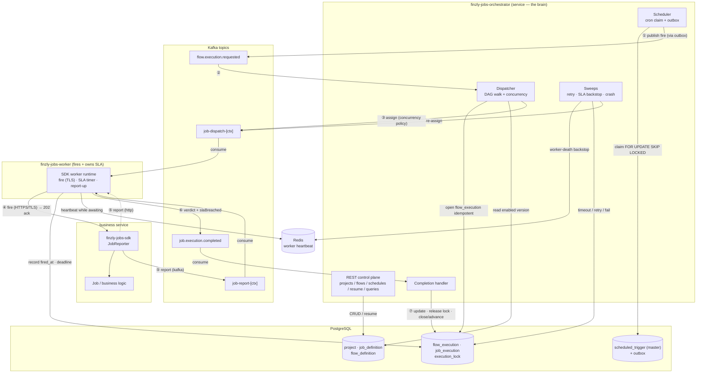
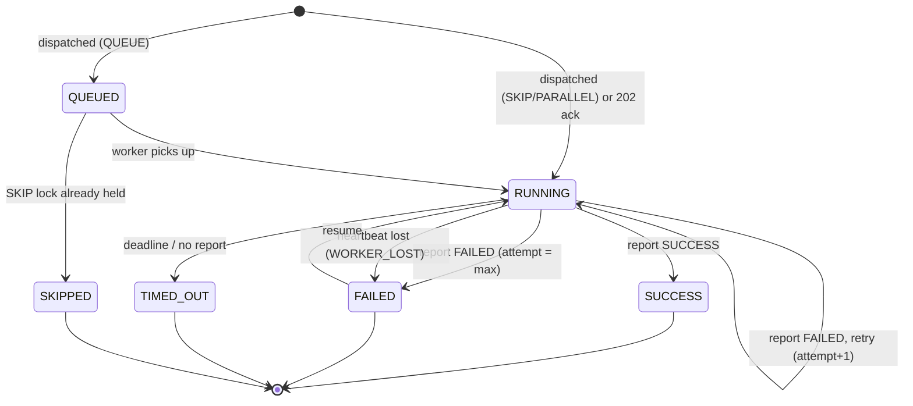

# finzly-jobs — System Diagrams (Mermaid)

Renders on GitHub and any Mermaid-aware viewer. Companion to
[LOW-LEVEL-DESIGN.md](LOW-LEVEL-DESIGN.md) and [SDK-INTEGRATION.md](SDK-INTEGRATION.md).

## 1. System overview



## 2. One fire, end to end (EVENT vs API, with report-back)

```mermaid
sequenceDiagram
    autonumber
    participant SCH as Scheduler
    participant DB as Postgres
    participant K as Kafka
    participant DIS as Dispatcher
    participant W as Worker
    participant S as Business service (SDK)
    participant R as Redis
    participant CMP as Completion

    SCH->>DB: claim due trigger (SKIP LOCKED), advance, write outbox
    SCH->>K: flow.execution.requested (outbox publisher)
    K->>DIS: consume
    DIS->>DB: open flow_execution (ON CONFLICT DO NOTHING)
    Note over DIS,DB: duplicate fire → no row → stop
    DIS->>K: job-dispatch-[ctx] (assign; SKIP takes execution_lock)
    K->>W: consume assignment
    W->>DB: record fired_at + deadline (RUNNING)
    W->>R: heartbeat while awaiting

    alt API job (HTTP fire)
        W->>S: POST callbackEndpoint (HTTPS/TLS verified) + JobHandle
        S-->>W: 202 Accepted  (ack ≠ complete)
    else EVENT job
        W->>K: publish to service eventTopic
        K->>S: consume
    end

    Note over S: async work, may outlive the fire
    alt service reports (transport = kafka)
        S->>K: job-report-[ctx]
        K->>W: consume report
    else transport = http
        S->>W: POST worker /report/{jobExecutionId}
    end

    W->>W: elapsed vs slaSeconds → slaBreached; or SLA timer fired → TIMED_OUT
    W->>K: job.execution.completed (+ slaBreached, elapsedMs)
    K->>CMP: consume
    CMP->>DB: update job · release lock · retry or close flow (FOR UPDATE)

    opt worker itself dies
        Note over R,CMP: worker heartbeat lapses
        CMP-->>DB: orchestrator sweep → FAILED(WORKER_LOST) → retry
    end
```

## 3. Job execution state machine



Legend: ① scheduler fire · ② dispatch · ③ assign to worker · ④ worker fires service
(TLS) · ⑤ service reports **back to worker** (kafka/http) · ⑥ worker verdict + SLA · ⑦
orchestrator completes. Solid = Kafka/DB, dotted = HTTP. **The worker owns the SLA
verdict because it made the fire.**
