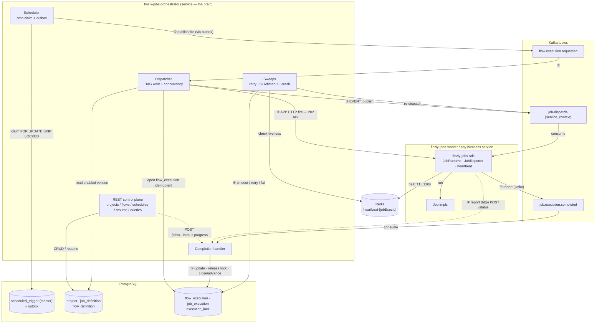
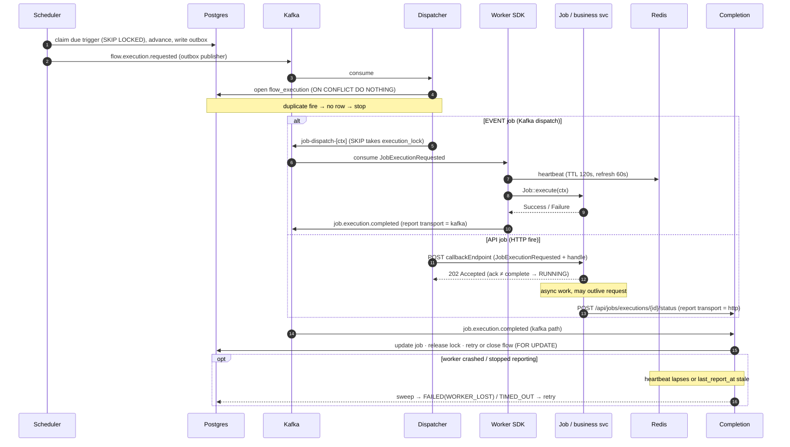
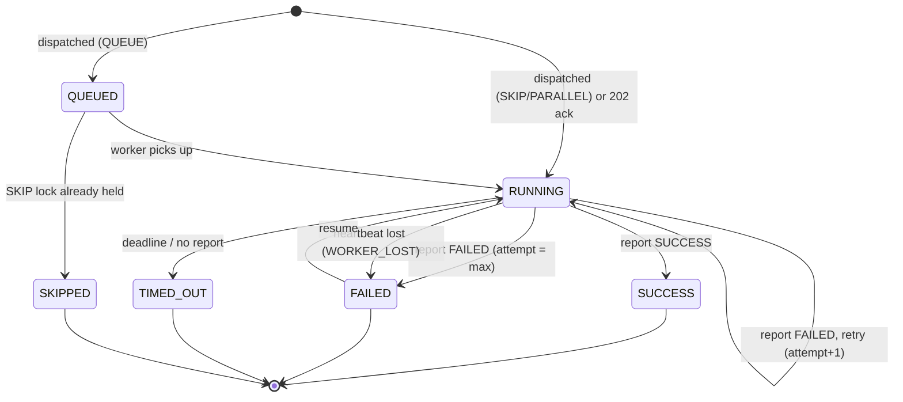

# finzly-jobs — System Diagrams (Mermaid)

Renders on GitHub and any Mermaid-aware viewer. Companion to
[LOW-LEVEL-DESIGN.md](LOW-LEVEL-DESIGN.md) and [SDK-INTEGRATION.md](SDK-INTEGRATION.md).

## 1. System overview

## 2. One fire, end to end (EVENT vs API, with report-back)

## 3. Job execution state machine

Legend: ① fire · ② dispatch decision · ③ dispatch (EVENT/API) · ④ report (kafka/http)
· ⑤ complete · ⑥ recover. Solid = Kafka/DB, dotted = HTTP.
